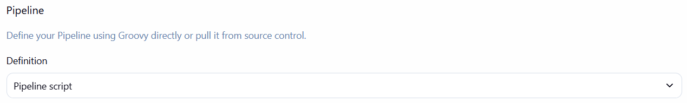

# 📋 Отчет по лабораторной работе  
**CI/CD Pipeline с Jenkins, Docker и GitHub**

## ✅ Выполненные задачи

### 1. Подготовка репозитория
- Создан репозиторий `my-jenkins-app` на GitHub
- Склонирован исходный код из репозитория преподавателя
- Настроен remote origin для личного репозитория

### 2. Настройка Jenkins Pipeline
- Создана джоба в Jenkins: `student-abubakirova-yasmin`
- Настроен Pipeline с параметрами:
  - `STUDENT_NAME`: Abubakirova Yasmin
  - `PORT`: 8094
- Кастомизированы имена Docker-образов и контейнеров
  
jenkins.jpg.png

### 3. Конфигурация Jenkinsfile
- Реализованы этапы пайплайна:
  - Очистка старых контейнеров и образов
  - Выгрузка кода из GitHub
  - Сборка Docker-образа
  - Запуск unit-тестов
  - Деплой приложения

### 4. Интеграция с GitHub
- Настроен Webhook для автоматического запуска сборок
- URL: `http://158.160.194.244:8080/github-webhook/`
- Активированы триггеры на push events

### 5. Тестирование работы
- Успешный ручной запуск сборки через Jenkins
- Проверка автоматического запуска при push в репозиторий
- Приложение доступно по адресу: `http://84.201.147.67:8094/`

## 🎯 Результаты

- ✅ Настроен полностью автоматический CI/CD пайплайн
- ✅ Реализована интеграция Jenkins + GitHub через Webhooks
- ✅ Приложение успешно проходит тесты и деплоится
- ✅ Обеспечена изоляция через Docker-контейнеры
- ✅ Параметризованная конфигурация для многократного использования

## 🔗 Ссылки

- **Jenkins Job**: http://158.160.194.244:8080/
- **GitHub Repo**: https://github.com/AbubakirovaYasmin/my-jenkins-app
- **Live Application**: http://84.201.147.67:8094/

